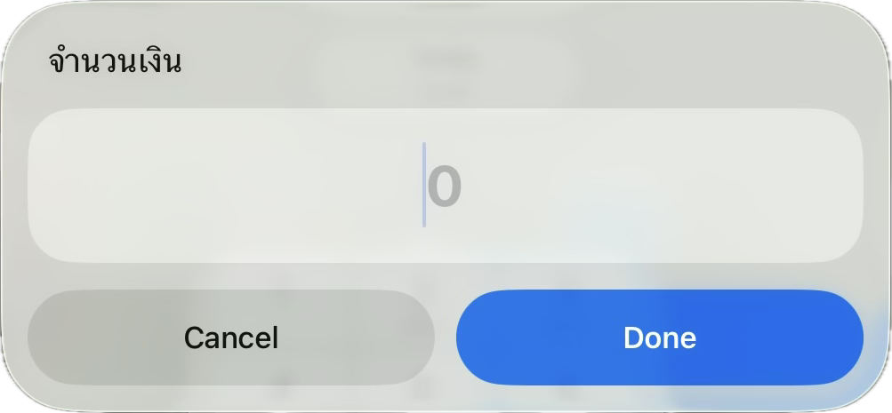
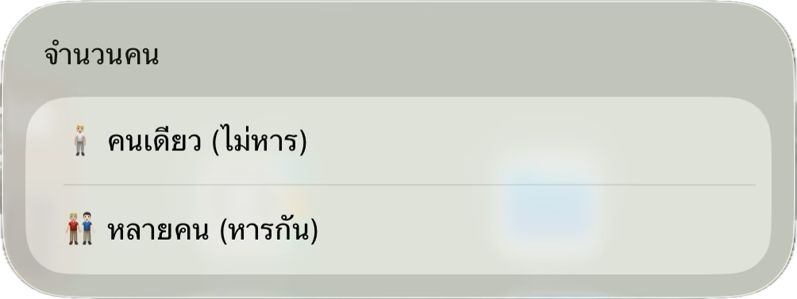
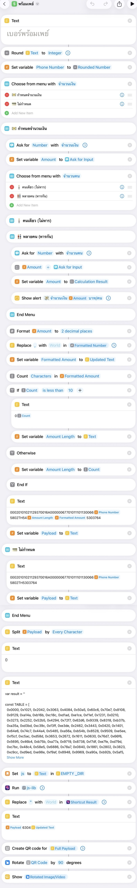

# Promptpay Shortcut
สร้าง Qr Code พร้อมเพย์รับเงินด้วย Shortcut (On Device)

## Requirement
- [js-lib](https://www.icloud.com/shortcuts/693d45985e97492a89d1ccb11011ca69)

## Installation
- [iCloud Link](https://www.icloud.com/shortcuts/31707891c3ec4a2197c3b702b378820f)
- [File](./พร้อมเพย์.shortcut)

## Preview

## Code

# References
- [promptpay-js](https://github.com/ihiroshi27/promptpay-js)
- [promptparse](https://github.com/maythiwat/promptparse)
- [Thai QR Payment Standard](https://www.bot.or.th/content/dam/bot/fipcs/documents/FPG/2562/ThaiPDF/25620084.pdf)
- [EMV QR Code](https://www.emvco.com/emv-technologies/qr-codes/)

# License
This project is MIT licensed (see [LICENSE](./LICENSE))